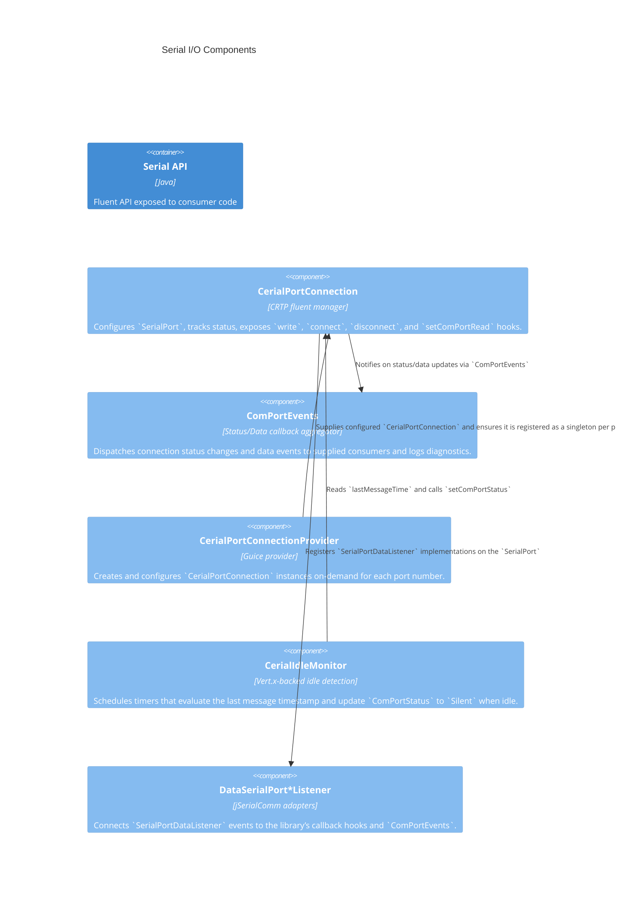

# C4 Component — Serial I/O Bounded Context

## Component responsibilities

- **CerialPortConnection** (source: `src/main/java/com/guicedee/cerial/CerialPortConnection.java`): Core CRTP domain object that exposes fluent setters, connection lifecycle methods, data writers/readers, and implements `IGuicePreDestroy` for clean shutdown as part of the GuicedEE lifecycle.
- **ComPortEvents** (`src/main/java/com/guicedee/cerial/implementations/ComPortEvents.java`): Central logging/reporting helper that surfaces status updates, event callbacks, and produces `ComPortStatus` summaries for consumers.
- **CerialPortConnectionProvider** (`src/main/java/com/guicedee/cerial/implementations/CerialPortConnectionProvider.java`): Guice provider responsible for instantiating each port’s `CerialPortConnection` with default config, packaging the port number and connection name.
- **CerialIdleMonitor** (`src/main/java/com/guicedee/cerial/CerialIdleMonitor.java`): Uses `IGuiceContext.get(Vertx.class)` to start/stop periodic timers that detect idle connections and update statuses.
- **DataSerialPortMessageListener` / `DataSerialPortBytesListener`** (`src/main/java/com/guicedee/cerial/implementations/`): Replace raw jSerialComm listeners with GuicedCerial-friendly callbacks that drive `ComPortEvents` and update the connection’s last message time.
