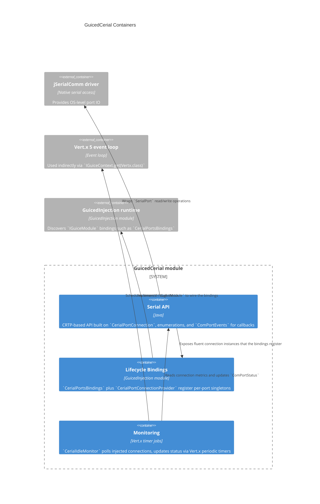

# C4 Container — GuicedCerial Library

## Container details

- **Serial API**: `CerialPortConnection` is the core CRTP type offering fluent configuration of `BaudRate`, `FlowControl`, `Parity`, etc. `ComPortEvents` funnels state changes to registered callbacks, while `DataSerialPortMessageListener` and `DataSerialPortBytesListener` wrap jSerialComm listeners.
- **Lifecycle Bindings**: `CerialPortsBindings` iterates over a fixed range of port numbers, delegating to `CerialPortConnectionProvider` to lazily instantiate each `CerialPortConnection` singleton. This binding is discovered by GuicedInjection during startup.
- **Monitoring**: `CerialIdleMonitor` obtains Vert.x from `IGuiceContext` to poll the last activity timestamp and escalate idle connections to `ComPortStatus#Silent`. It translates timer callbacks into status updates consumed by `ComPortEvents`.
