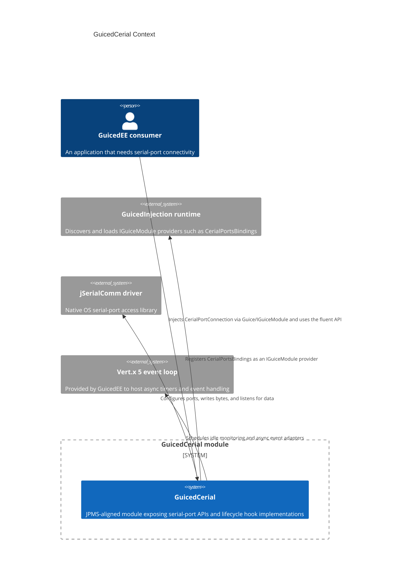

# C4 Context — GuicedCerial

## Narrative

GuicedCerial is the serial-port helper module within the GuicedEE ecosystem. It plugs into GuicedInjection via `CerialPortsBindings` so that `CerialPortConnection` instances can be injected by name. The module depends on the Vert.x event loop retrieved from `IGuiceContext` for timers (e.g., `CerialIdleMonitor`). Actual byte-level access is delegated to the `jSerialComm` driver, while callers interact through the CRTP-style `CerialPortConnection` API and the `ComPortEvents` handler.
