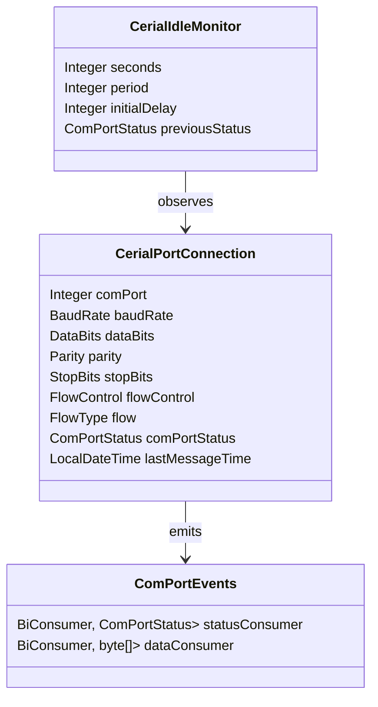

# ERD — Serial Domain Objects

This diagram captures the core domain objects defined in `com.guicedee.cerial`. The `CerialPortConnection` stores every serial-port configuration parameter and emits events through `ComPortEvents`. `CerialIdleMonitor` references the connection to evaluate `lastMessageTime` and transition `ComPortStatus` when necessary.  
