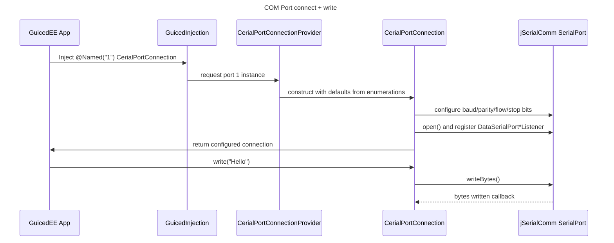

# Sequence — Opening and Writing to a COM Port

Notes
- GuicedInjection discovers `CerialPortsBindings` because it implements `IGuiceModule` (`src/main/java/com/guicedee/cerial/implementations/CerialPortsBindings.java`).
- `CerialPortConnection` configures port parameters using the CRTP setters in `src/main/java/com/guicedee/cerial/enumerations` and sends data via the `com.fazecast.jSerialComm.SerialPort` instance.
