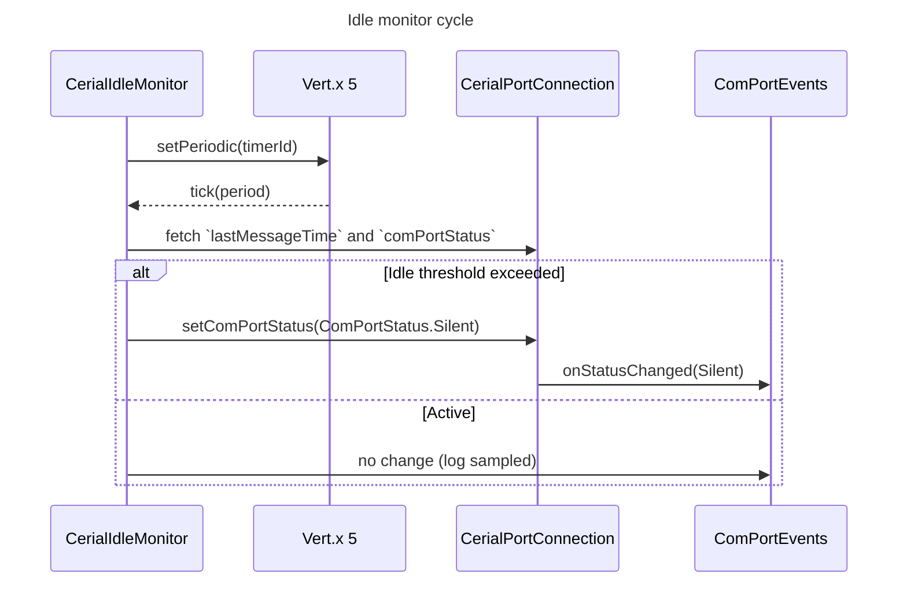

# Sequence — Idle Monitor Updates Silent Status

Notes
- `CerialIdleMonitor` uses `IGuiceContext.get(Vertx.class)` at runtime (see `CerialIdleMonitor.begin()`).
- When a connection is marked `ComPortStatus.Silent`, `ComPortEvents` propagates the transition to any registered consumers.
